# COVID-19 Notification App - Solution Architecture

## Baseline for the "Proof of Concept"

**Version:** 1.0 (12/8/2020)

# Introduction

The ministry of VWS is currently investigating if and how a contract tracing app could be used to help with the current corona crisis. As there are significant technical, privacy, epidemiological and behaviour-science related challenges this will initially be a "Proof of Concept" (PoC) only.

This document describes the functional and technical architecture of this PoC. Note that, as part of the Dutch Covid19 response, there are also several other workstreams happening in parallel (such as for example investigating a follow up, post infection, support app). 

The requirements document received from the Dutch health authority GGD are leading in the decisions in this solution architecture. The original requirements document can be found at [https://www.rijksoverheid.nl/binaries/rijksoverheid/documenten/publicaties/2020/05/19/programma-van-eisen/20200519+Programma+van+Eisen+def.pdf](https://www.rijksoverheid.nl/binaries/rijksoverheid/documenten/publicaties/2020/05/19/programma-van-eisen/20200519+Programma+van+Eisen+def.pdf)

**This document only details the proof of concept for exposure notification.**

# Table of contents

- [COVID-19 Notification App - Solution Architecture](#covid-19-notification-app---solution-architecture)
  * [Baseline for the "Proof of Concept"](#baseline-for-the-proof-of-concept)
- [Introduction](#introduction)
- [Table of contents](#table-of-contents)
- [Guiding principles](#guiding-principles)
- [Key characteristics](#key-characteristics)
  * [Decentralised approach](#decentralised-approach)
  * [Bluetooth Low Energy (BLE)](#bluetooth-low-energy-ble)
  * [Google/Apple Exposure Notification framework (GAEN)](#googleapple-exposure-notification-framework-gaen)
- [Baseline Approach](#baseline-approach)
  * [Recording encounters](#recording-encounters)
  * [Taking a test](#taking-a-test)
  * [Checking for exposures](#checking-for-exposures)
  * [Risk assessment](#risk-assessment)
  * [Notification of exposure](#notification-of-exposure)
  * [Summary](#summary)
- [System Landscape](#system-landscape)
- [Security & Privacy](#security--privacy)
  * [Overview](#overview)
  * [Data cleanup](#data-cleanup)
  * [Traffic Analysis Mitigation](#traffic-analysis-mitigation)
- [Lab result validation flow](#lab-result-validation-flow)
- [Backend Considerations](#backend-considerations)
  * [Backend overview](#backend-overview)
  * [Infrastructure](#infrastructure)
  * [App/Device Verification](#appdevice-verification)
- [App Considerations](#app-considerations)
  * [Native vs hybrid development](#native-vs-hybrid-development)
  * [Lifecycle Management](#lifecycle-management)
- [GAEN protocol considerations](#gaen-protocol-considerations)
  * [Challenges to be addressed](#challenges-to-be-addressed)
  * [Proposed enhancements to the GAEN protocol](#proposed-enhancements-to-the-gaen-protocol)

# Guiding principles

We have defined a number of guiding principles that a solution must adhere to. This means that this project has a number of key contextual requirements that drive or otherwise define the architecture or are used as a benchmark:

* The eHealth Network toolbox  "[Mobile applications to support contact tracing in the EU's fight against COVID-19](https://ec.europa.eu/health/sites/health/files/ehealth/docs/covid-19_apps_en.pdf)" as published by the European commission 

* The key principles as published by "[Veilig Tegen Corona](https://veiligtegencorona.nl)" (This is an approximate translation of the key principles, see the Veilig Tegen Corona site for the original Dutch manifesto):

1. Only one goal: keeping the virus under control

2. Based on scientific insights and proven to be effective

3. Proven to be reliable and built from expertise

4. Deployment of the app is temporary, by default

5. Not relatable to individuals

6. Use as few details as possible

7. No central storage of personal details

8. Safe and resilient against abuse

9. User friendly and accessible

10. Government and third parties are not allowed to force or require the use of the app

* The baseline standard that applies to all government systems in the Netherlands:

* [Baseline Informatiebeveiliging Overheid 1.04](https://bio-overheid.nl/media/1400/70463-rapport-bio-versie-104_digi.pdf)

* [Algemene Verordening Gegevensbescherming (AVG)](https://autoriteitpersoonsgegevens.nl/sites/default/files/atoms/files/verordening_2016_-_679_definitief.pdf) 

* [Handreiking Mobiele App Ontwikkeling en Beheer 3.0](https://www.noraonline.nl/images/noraonline/a/a5/Handreiking_Mobiele_App_3.0.pdf) 

* [Web Content Accessibility Guidelines 2.1](https://www.w3.org/TR/WCAG21/)

* [NCSC beveiligingsrichtlijnen voor webapplicaties](https://www.ncsc.nl/documenten/publicaties/2019/mei/01/ict-beveiligingsrichtlijnen-voor-webapplicaties)

* [NCSC beveiligingsrichtlijnen voor mobiele apps](https://www.ncsc.nl/documenten/publicaties/2019/mei/01/ict-beveiligingsrichtlijnen-voor-mobiele-apps)

# Key characteristics

## Decentralised approach

Like most EU countries - the Netherlands believes that a decentralised approach (i.e. no central tracking) best meets the privacy and security expectations of society.

This Proof of Concept therefore focuses on this approach; at the expense of a Central approach.

## Bluetooth Low Energy (BLE)

There are several ways in which contact/encounters between people may be registered on a smartphone; from a simple manual diary to GPS to bluetooth and so on. 

The EU Toolbox recommends the use of Low Energy Bluetooth (BLE).  Although this project keeps open other options - our first ‘Proof of Concept’ version will be BLE based. 

It is well documented that BLE measurements are inaccurate. For this reason there are several parallel activities (both in this project, by other countries and in collaboration with the other member states) to validate and verify this in field tests and to establish the level of accuracy that we can achieve and whether that is sufficient.

It is also known that for BLE on mobile apps on Android and iOS to work reliably in the background, there is a need for either a) relatively low level access (which is not routinely granted by the vendors)  or b) it is required to use the Google/Apple Exposure Notification framework.

## Google/Apple Exposure Notification framework (GAEN) 

Given the timeline (and the desire for cross border interoperability within the EU eHealth network) this ‘‘Proof of Concept’ - a GAEN based approach is currently given priority. 

However it should be noted that alternatives are kept open. We have identified several privacy/security- and practicality issues that will have to be addressed by Google and Apple, or suboptimal workarounds need to be implemented. Based on testing and the international conversations we are having around this subject, we will continuously evaluate if the GAEN path is still the right one.

# Baseline Approach

This chapter describes the core flow that we are following, which is partially dictated by the choice of protocol.

## Recording encounters 

As described in the GAEN document set - the users’ mobile phones are able to record ephemeral IDs of other phones they meet. These are generated from a daily seed key (Temporary Exposure Key, TEK). Details about this can be found in the GAEN documentation (See Cryptography Specification: [Apple](https://www.apple.com/covid19/contacttracing), [Google](https://www.google.com/covid19/exposurenotifications/)), but it boils down to the following:

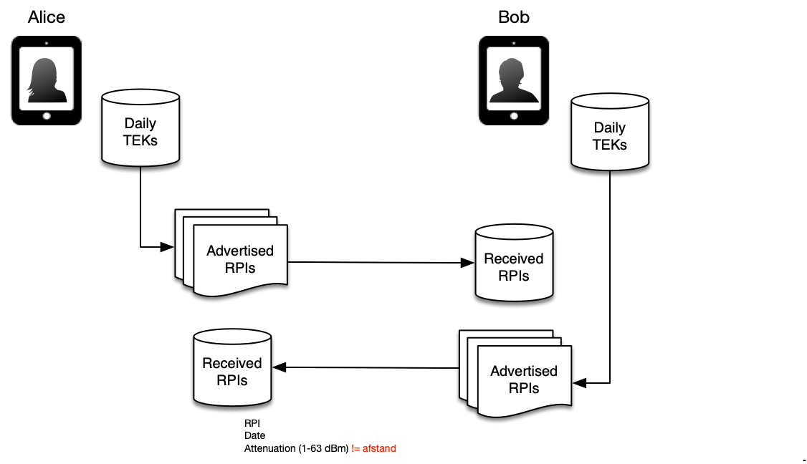

From the daily keys a set of Rolling Proximity Identifiers (RPI) is generated that are exchanged between phones over Bluetooth Low Energy and get recorded on the recipient's device. The device records the ‘attenuation’ of the encounter. This is a representation of how near the devices were, but is not an exact representation of distance. It can later be used to calculate the probability that this encounter was risky.

## Taking a test

At some point a person carrying the app on their phone may get tested at a test centre (e.g. referred by a GP, on request of the GGD, etc -- see the PVE document). 

It is expected that at this point the TEKs of that person are captured and sent to a central server:

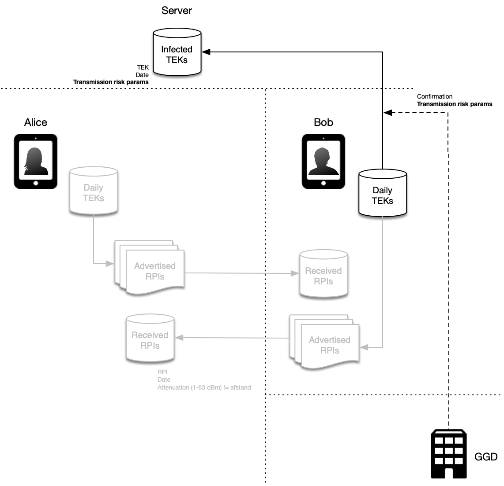

This upload should be validated / authorised by a health authority, so that people cannot upload their keys without a validated positive test result. (As per the requirements, we will not support self-assessment at this point). The keys are not shared (i.e. uploaded to the central server) until after the infected person has been informed of the test result and has provided consent to share the keys.

The GAEN protocol has the ability to enhance the keys with a ‘transmission risk parameter’ which allows to provide 8 levels of ‘infectiousness’. (Whether this parameter will be used and how, should be determined by GGD/RIVM and is, for now, out of scope of the architecture.)

The infected keys are, at regular intervals, batched, signed and pushed out to a CDN. Once the batches are available on the CDN, the keys are no longer needed in the central database so they can be removed.  

## Checking for exposures

Once the keys are available on the CDN, clients can download the sets of infected keys and use these to verify if they have encountered an infected person.

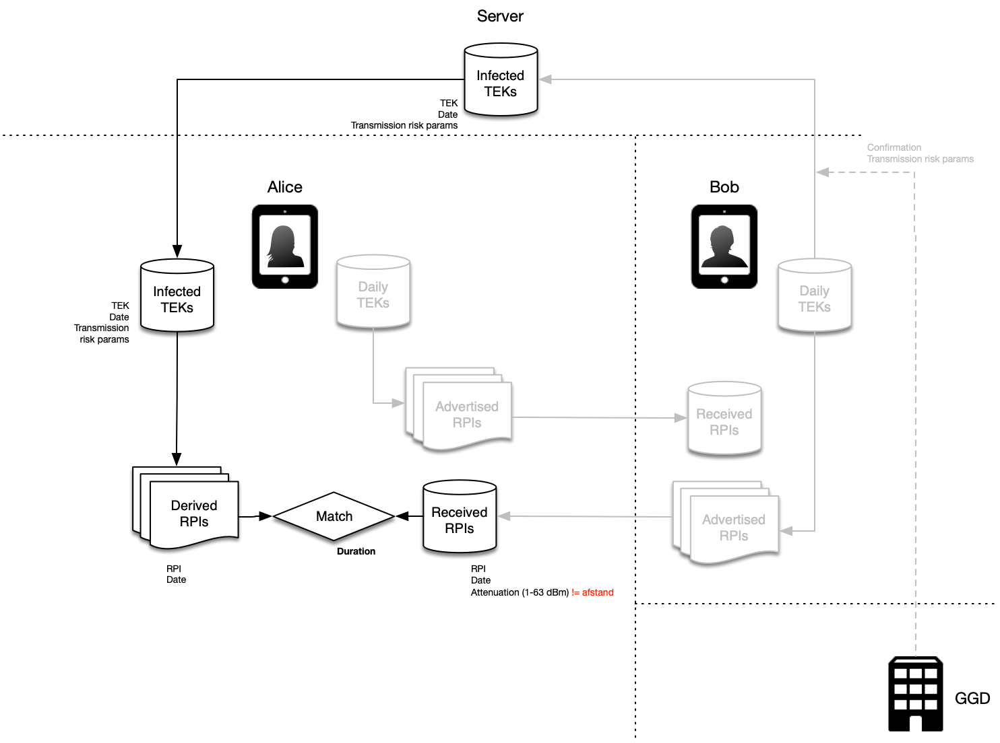

This match takes place entirely on the user’s phone. By deriving the set of RPIs from the infected TEK that a user received, it can compare these to the RPIs it has recorded. If there is a match, it can use its previous recordings to determine the approximate duration of the encounter.

## Risk assessment

Once the device has determined that it has seen the phone of an infected user, the next step is to calculate the risk that the phone’s owner could be infected. This assessment is performed on the phone.

The following parameters are available to the calculation:

1. The ‘attenuation’ (an approximation of how near the phones were)

2. The date on which the encounter happened (e.g. if it was longer ago, the risk might be lower)

3. The duration of the encounter

4. The transmission risk parameter, if provided by GGD

The GAEN protocol breaks each parameter up into 8 buckets. By assigning values to these buckets, GGD can influence the calculation of the risk. Since these values are not defined by technology but should be provided by experts who can assess the risk, the architecture prescribes that the input values for this calculation can be retrieved from a server, so that they can be adjusted over time.

For an understanding of how these buckets and parameters work, we have made available a test sheet that can be copied and used to get an understanding of the calculation: [https://docs.google.com/spreadsheets/d/18RVkBjahiVxd3lLgOS7weKEoc8KxxTufZVQ2exWOgR4/edit?usp=sharing](https://docs.google.com/spreadsheets/d/18RVkBjahiVxd3lLgOS7weKEoc8KxxTufZVQ2exWOgR4/edit?usp=sharing)

**Note:** A prior version of the GAEN protocol allowed these experts to not only assign scores to the buckets, but also to provided weights that could be used to make, for example, duration more important than attenuation. These weights have been removed in the mid-May 2020 version of the GAEN protocol.

## Notification of exposure

The final step in the flow is to notify the user of an exposure if the risk calculation exceeds a certain threshold. 

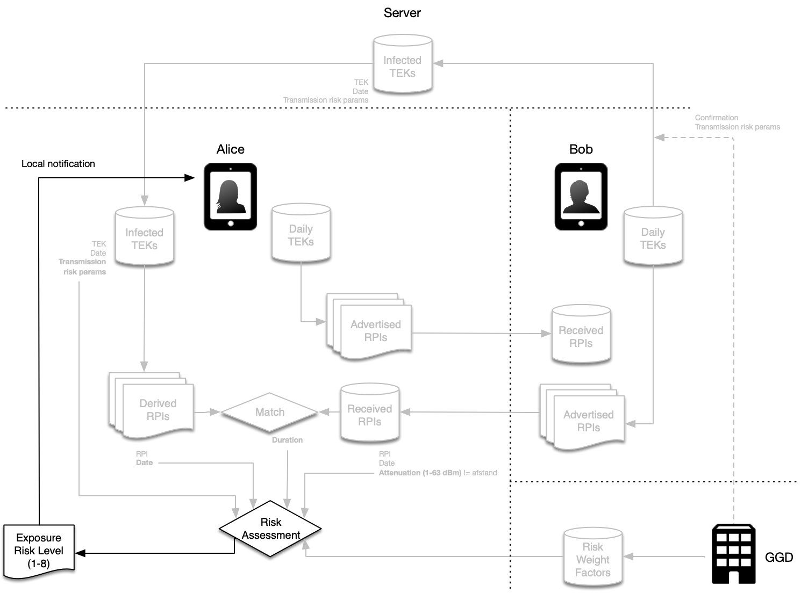

Note: the diagram indicates a calculated risk level of 1-8, but after the weights were removed from the latest version of the GAEN protocol, this level is now a number between 0 and 4096 (or 255; parts of the GAEN documentation mention a cap at 255)

If the level exceeds a threshold to be defined by experts, the app can provide the user with a notification. This happens entirely locally on the user’s device. The notification is NOT sent by a server. 

## Summary

The following diagram provides an overview of all the above steps, in a single picture:

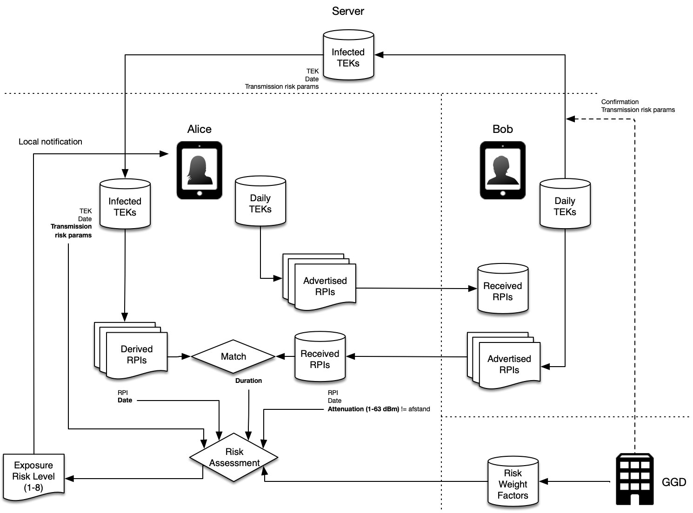

Key elements to be built

* A mobile app. Key here is penetration, broad participation (supporting old android phones and small MB/Bundles & prepaid are important)

* A distribution service that distributes the "public" keys. Optimised for best effort, bulk distribution of essentially static files that change a few times per day.

* A submission service which sees very little traffic (just those getting tested that day) but which should be optimised for ‘not losing data’ and authorizing the upload.. 

* A portal for health staff that pushes through the infected keys; and, as it is in key primary workflows of the health authorities, should be very stable and ‘always up’. It is also the system that is closest to (what little) data that is sensitive; so it will require authentication of an appropriate level. Integration with the workflows of the health authorities should be kept to a minimum so that health and personal information that is not needed for solid exposure notification, is confined to the health system and can not be stored inside the app ecosystem / backends. 

# Security & Privacy

## Overview

The details surrounding the security and privacy implementation of the Proof of Concept is laid out in the document [‘Crypto Raamwerk’](Crypto Raamwerk.docx). While the details and rationale surrounding the choices can be found in that document, for this solution architecture we have outlined the key principles from the preliminary version in the following diagram.

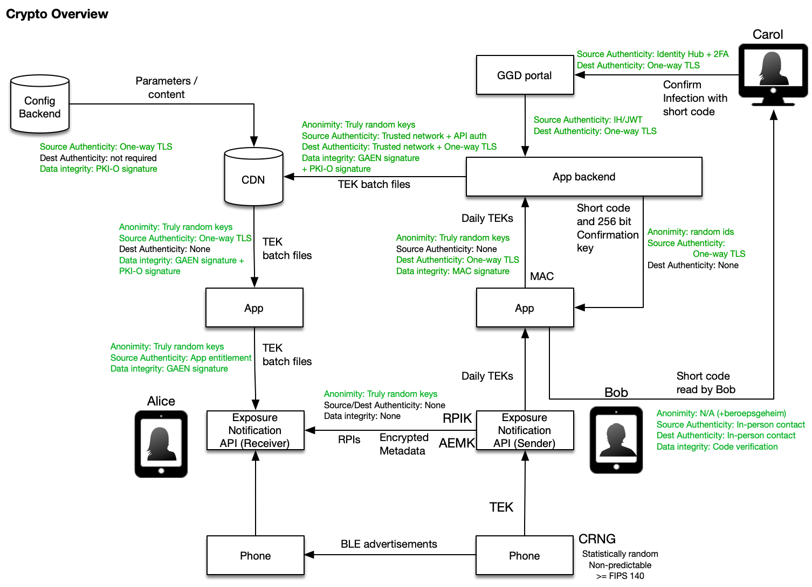

Each part of the diagram tries to address a number of key aspects:

* Anonymity: how is the anonymity / privacy of the user protected

* Source authenticity: how can we ensure that data comes from a known / trusted source

* Destination authenticity: how can we ensure that data gets sent to a known / trusted source

* Data integrity: how can we ensure that the data has not been tampered with.

## Data cleanup

We don't want to keep data around longer than necessary. Therefor we have defined a few rules we apply for data cleanup.

### Backend 
1) Lab confirmations that aren't followed by uploaded TEKs should be deleted after 24 hours.
2) TEKs that aren't confirmed with a positive test should be deleted after 24 hours.
3) Buckets for TEK uploads should be removed within 4 hours after the confirmation key expires (the 4 hour grace window will help with devices with a skewed clock/timezone).
3) Files on the CDN should be removed after 14 days.
4) Files on the CDN should be pruned of keys that are older than 14 days.
5) Cache headers on Exposure Key Sets on the CDN (maxage, s-maxage, etc) should reflect the same lifetimes, so that intermediary caches can follow the same pattern. 

### Apps
1) The apps should retrieve TEK keys from the GAEN framework and then retain them only for as long as is necessary to upload them (no permanent storage).
2) Downloaded EKS files from the CDN that have been processed by the framework should be immediately removed. (The app should only remember the file hash). 
3) Confirmation keys / bucket ids should be cleaned up when the validity of the key has expired. 

## Traffic Analysis Mitigation

To ensure that an eavesdropper in or on the network can not derive any contamination or exposure conclusions from the traffic he can see, we take the following measures:

1. The upload should use TLS to protect the contents of a request

2. Apps should randomly execute ‘decoy’ requests that can’t be distinguished (from the outside) from a real request, so that the fact that a request is made, does not reveal anything about the user. Since TLS will protect the URL of the request, we can use explicit decoy names such as ‘/stopkeys’ instead of /postkeys’, so that such requests can be dropped early in the infrastructure and don’t reach the actual application.

3. The request signatures and payload for POST/PUT requests such as the upload of keys, should be exactly equal so that an eavesdropper is not able to derive from the length or signature of a request that a user is uploading fake keys. (If necessary the payload should be padded)

4. Requests should not use headers that can be used to infer information about a user. E.g. a language accept header that downloads only a specific language file. It is better to download all languages and make the decision client side.

A detailed design for the decoy requests can be found in the document ['Traffic Analysis Mitigation with Decoys'](Traffic Analysis Mitigation With Decoys.md).

# Lab result validation flow

To ensure that only keys are uploaded that belong to positive test results, we have 2 types of flows. One 'low tech, works everywhere' flow for situations where we can't integrate with the health authority system but the user still needs to be able to use the app. One more advanced flow that integrates with the health authority system. The low tech flow works with one-time 'Infection Confirmation Codes'. 

The flow is designed to:

* Minimize the effort for users and professionals
* Maximize privacy
* Be applicable with ‘low tech’ (adding conveniences such as a QR are ‘on top’ of the basic low tech flow and not a requirement).
* The low tech nature also allows to use channels such as a phone call to exchange tans.

## Variant 1: Separate GGD portal

### Phase 1: Logging in to the portal

The key ingredient of Variant 1 is the use of a separate portal to confirm infections. Because there is no link to the health authority system for patients that are in this flow, the responsibility is with the callcenter staff that calls the patient. They check positive status in their respective systems and using a web portal, they confirm an infection for this patient. Note that this is an extremely privacy friendly flow because the app backend has zero ties to any real lab result or personal data. There simply is no personally identifiable patient data anywhere in the lab backend (privacy by design).

The following data flow diagram depicts how a user will authenticate with the portal.

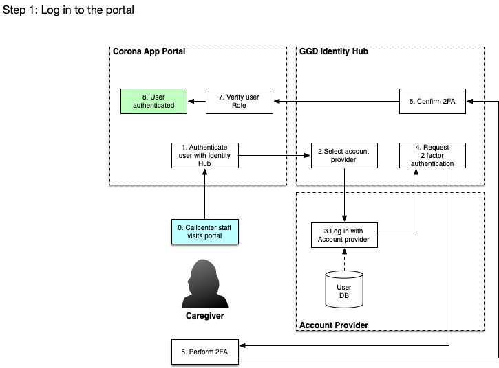

### Phase 2, step A: Calling the patient and exchanging a key

When the patient is called, a token is exchanged for a 256 bit key. The shorter token is useful to communicate over the phone, but we want to exchange it for a 256-bit key because there's some time between the first key upload and the last key upload (which apple and google only release after midnight) and we want to have protection against brute force attacks on the key exchange. (the infrastructure will also mitigate these attacks but our policy is that the data should be secure regardless of the infrastructure quality). We call the process an 'enrollment' because it equips the phone with a key.

Note that although the process has many steps, for the user this is just the part where the caller ask the user for a code. 

Note 2: we have chosen to have the user read a code to the operator instead of the other way round, to a) avoid mistakes and b) not give the app 'proof' that the user is infected. The app should help the user read the correct code. 

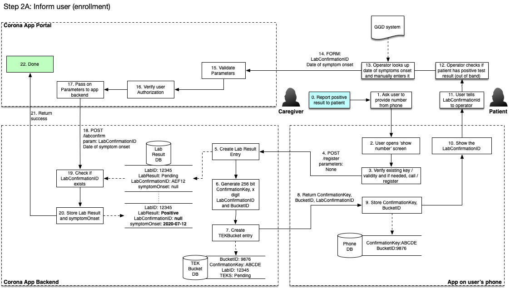

### Phase 2, step B: Asking the patient to upload keys

Once the user has read the key to the operator, the operator asks the user to upload his keys. The user presses a button in the app, gives final consent (by way of the popup that Apple/Google present) and the keys get uploaded. The following diagram depicts this process:

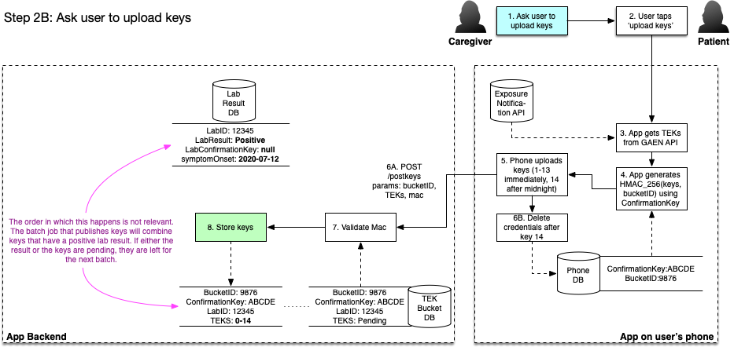

Note that this only stores the keys in our database, and doesn't yet publish them. We need a final step to get the keys published, which is covered in the next paragraph.

Note 2: A privacy feature of this approach is that the phone never has any clue if the user has received a positive test. Although we read the keys from the apple/google api and upload them, this doesn't guarantee to the phone itself that a user is positive. In fact, a user might choose to simply upload his keys even though there's no test. This helps blind the actual keys uploads. Keys that get uploaded like this never get published because the positive lab indication will be missing. So only if both conditions are true (user has uploaded their keys with consent AND a lab result confirmed a positive test), the exposure keys get distributed. Keys or lab results that don't have matching conditions, get cleaned up and deleted after a timeout period.

### Phase 2, step C: Checking if the upload succeeded

Once the keys are uploaded, the GGD employee can check if the upload succeeeded. This does not give the GGD access to the key, the backend system only returns a true/false if the upload in step B was succesful. A system of temporary poll tokens is used to refresh the UI and display a 'check mark' in the portal upon success. Poll tokens have a lifetime of 30 seconds.

### Phase 3: Publishing the keys

At regular intervals, all keys that are confirmed with a positive result get packaged, signed and distributed via our CDN. The data flow diagram for this final step is this:

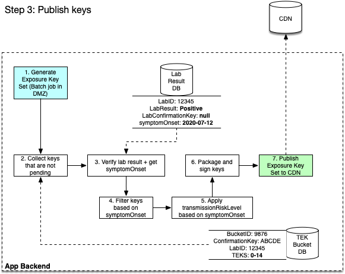

Note that while we use the keys from the previous phase as an example in the diagram, this process is not specific to one set of keys. All keys that have been added since the previous batch, get packaged together.

## Variant 2: Integration with Health Authority systems

# Backend Considerations 

## Backend overview

The following diagram illustrates the required backend components to be able to satisfy the requirements:

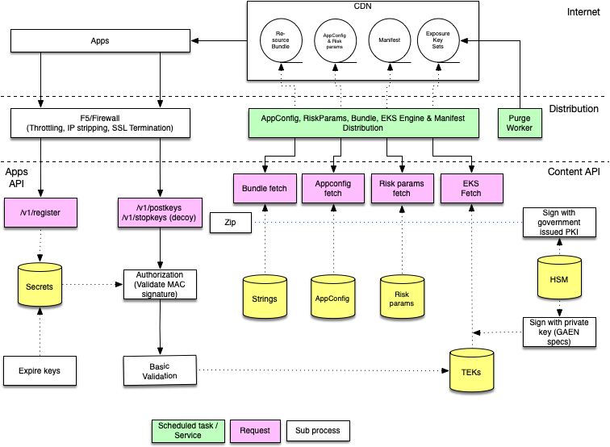

## App/Device Verification

The Google Reference Implementation of a backend for exposure notification suggests the use of DeviceCheck (iOS) and Safetynet Attestation (Android) to validate if a request comes from a genuine android device and/or from the official app:

* [https://github.com/google/exposure-notifications-server/blob/master/docs/server_functional_requirements.md](https://github.com/google/exposure-notifications-server/blob/master/docs/server_functional_requirements.md)

The documentation for DeviceCheck and Safetynet Attestation can be found here:

* [https://developer.apple.com/documentation/devicecheck](https://developer.apple.com/documentation/devicecheck)

* [https://developer.android.com/training/safetynet/attestation](https://developer.android.com/training/safetynet/attestation)

We have decided not to apply these platform specific checks. First, it relies on a server API at Apple and Google, which can be down and could be a privacy risk.

Second, the Android Developer blog states: 

"*In other words, not all users who fail attestation are necessarily abusers, and not all abusers will necessarily fail attestation. By blocking users solely on their attestation results, you might be missing abusive users that don't fail attestations. Furthermore, you might also be blocking legitimate, loyal customers who fail attestations for reasons other than abuse*" (NOTE:  https://android-developers.googleblog.com/2017/11/10-things-you-might-be-doing-wrong-when.html)

The safetynet attestation documentation further states about attestation failure: *"Most likely, the device launched with an Android version less than 7.0 and it does not support hardware attestation. In this case, Android has a software implementation of attestation which produces the same sort of attestation certificate, but signed with a key hardcoded in Android source code. Because this signing key is not a secret, the attestation could have been created by an attacker pretending to provide secure hardware"* (NOTE:  https://developer.android.com/training/articles/security-key-attestation)

This leads us to believe that when applying these checks, we introduce risks and dependencies while not gaining a substantial amount of security.

# App Considerations

## Native vs hybrid development

Mobile apps will be implemented as native applications, with Swift as the language used for iOS development and Kotlin for Android development.

(Note: The Google example application for the GAEN protocol was written in Java, but a rationale for this wasn’t provided. Therefore we are following the general consensus that Kotlin is the language of choice for all new app developments.)

We have carefully considered whether to do native development or use a cross platform technology, and the following arguments were leading:

* There are no requirements or constraints that dictate the use of cross platform tools.

* The GAEN protocol implementations are native APIs

* The available development team has sufficient capability in native app development.

* It is expected that, should we need help from Google or Apple to resolve issues while implementing their protocol, they can do so more efficiently if we use the development stack provided by the vendors.

* In order to ease [security] code-reviews and thus keeping them accessible to a wider audience, it is prudent to keep the app's stack and usage of programming paradigms as vanilla and lean as possible.

## Lifecycle Management

Apps run on the user’s device and updates require a review process that is not entirely under our control. To mitigate these factors that are outside our control, apps should implement a form of lifecycle management. This includes the following features:

* Configuration values or content that are expected to change should be retrieved from a server.

* Apps should offer a ‘forced upgrade’ (i.e. if a new version is available that fixes a critical bug, it should be possible to force the user to upgrade). It is recommended that this forced upgrade can distinguish between the base operation (recording encounters) and other users, so that while we wait for the user to upgrade, they can still record their exposures.

# GAEN protocol considerations

## Challenges to be addressed

There is a challenge in getting the complete set of keys uploaded on the day of the test result. Google and Apple will hold the current TEK key until roughly midnight, so the last key can’t be uploaded until then. Releasing the keys requires user consent, but this consent is not a problem since it is valid for 24 hours, so as long as we deliver the last key within 24 hours, that is covered. But the potential risk of this ‘key embargo’ is delay: the key is relevant to people who have met a person on the day of that person’s test result, but they won’t be notified until the next day. Since someone who was at risk won’t be infectious right away, there is still time to advise this person to take measures. Still, a delay is a delay, so one of our proposals contains a suggestion to make the key release immediate. 

From a technical perspective, the apps will have to implement a delayed key upload that is scheduled in the background, so that the key, once it becomes available, gets added to the pool of keys. Since background operations are always a risk (the user might have turned off their phone), this is something to take into account.

## Proposed enhancements to the GAEN protocol

There are some additional considerations that are not easy to work around, which is why we have created the following change requests for enhancements to the GAEN protocol:

* GACT-TIME - A proposal to remove the ‘time’ (and optionally the ‘date’) characteristics from the protocol, so that RPIs can not be linked to a specific time of the day, to adhere to the ‘Use as few details as possible’ guideline.

* GACT-PKI - A proposal to add a PKI based validation chain to TEK batch files, so that on a transparent CDN, a client can securely verify whether batches of TEKs originate from an official government source.

* GACT-VF - A proposal to add a ‘validated feedback’ loop, which allows a user to ‘prove’ that he has received a notification. This is important to securely implement requirements such as requirement F12 (the ability to get tested based on a notification).

Proposals that have been drafted, but later decided that we do not need them:

* GACT-VF-EW - A proposal that builds on top of the above mentioned GACT-VF and adds an ‘early warning’ system by implementing a secondary contact tracing protocol. Although it will not be used in the Proof of Concept app, we have published it for other parties to consider.
